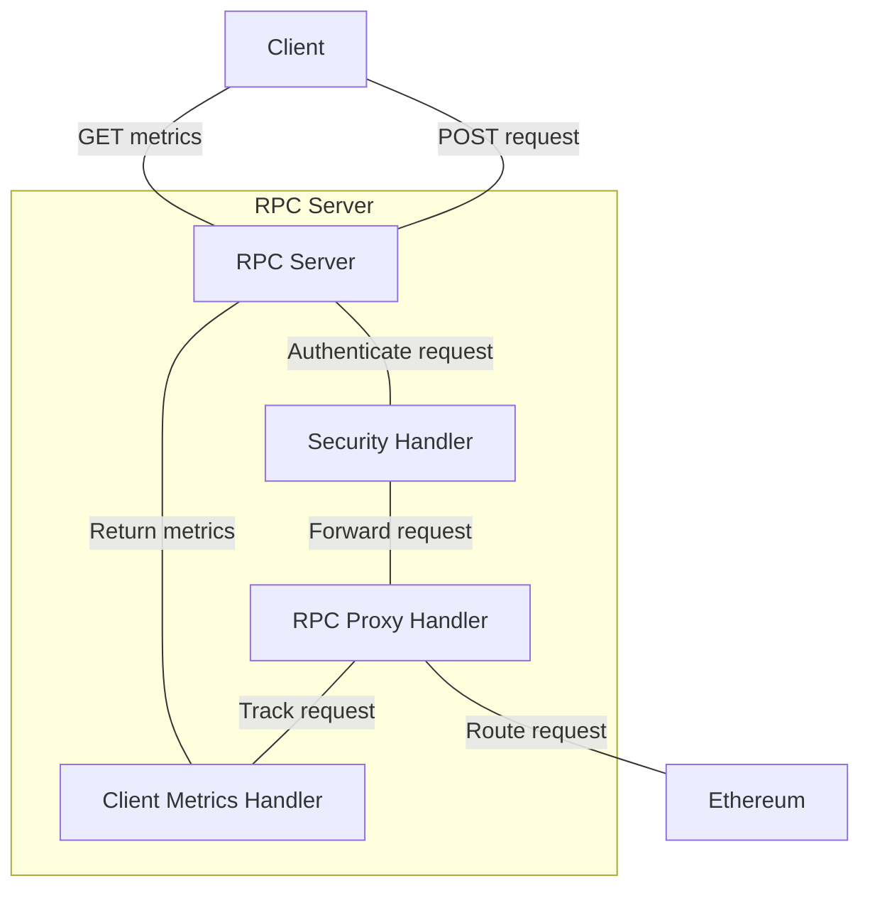

# Json RPC Proxy Gateway

### Objective:

Develop a Java application using the Vert.x framework to serve as a proxy for JSON-RPC 2.0 requests between clients and
an Ethereum blockchain node.

#### Notes

- *WARNING* This application uses a self-signed certificate for SSL. It is kept in the source code and is not suitable
  for production use.
- The source code contains "todo" with considerations for improvement and Javadoc implementation notes on design
  decisions.
- There is one test to demonstrate application integration and process, typically I would aim for coverage >80% and utilise more unit tests to fail fast

---

### Functional Requirements:

1. JSON-RPC 2.0 Proxy: Implement a service that receives JSON-RPC 2.0 requests, forwards them to a designated Ethereum
   node endpoint, and returns the responses to the client.
   Target Node: Use any publicly accessible Ethereum client endpoint. A free API key for Tatum RPC can be obtained if
   needed.
2. TLS Termination: Secure incoming client connections using TLS.
3. Access Logging: Log basic information about incoming requests
4. Method Call Tracking: Maintain a count of invocations for each distinct JSON-RPC method. Provide a mechanism to
   expose these counts (e.g., via a simple API endpoint or specific log output) for potential billing integration.

### Non-Functional Requirements:

1. Performance: Design the application with performance considerations in mind, leveraging the asynchronous capabilities
   of Vert.x.
2. Maintainability: Structure the code clearly and logically.

---

### System Overview

1. When a request is made to the proxy server ```/rpc``` endpoint the security handler validates the api-key and the client id is added to
   the request context.
2. The request is passed on to the Proxy handler that routes the request to Ethereum and updates the client metrics
   handler which tracks the client invocations.
3. Client invocations are exposed by an endpoint at ```/clients/invocations```



### Getting Started

To launch your tests, set the eth url to local port 8443 where wiremock is configured.

```bash
ETH_URL='http://localhost:8443' ./gradlew clean test
```

To run the application locally:

```bash
ETH_URL='https://ethereum-mainnet.gateway.tatum.io' ./gradlew clean run
```

To package your application:

```bash
./gradlew clean assemble
```

To build and launch the docker. First package the application and start docker then:

```bash
docker-compose up -d
```

To invoke the running API, first signup to https://dashboard.tatum.io/ and get a free mainnet API key and send it with your request.

```bash
API_KEY=dummy
curl -k -X POST https://localhost/rpc -H "Content-Type: application/json" -H "x-api-key: $API_KEY" -d '{"jsonrpc":"2.0","method":"eth_blockNumber","params":[],"id":83}'
```

To get the count of client invocations

```bash
curl -k -X GET https://localhost/clients/invocations
```
Alternatively open the [Bruno Collection](bruno/ETH)

### Tech stack

- Java 21
- Vert.x framework
- RxJava
- Docker
- Wiremock
- Junit
